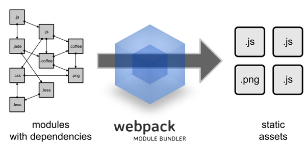

# webpack入坑之旅（一）不是开始的开始

> 最近学习框架，选择了vue，然后接触到了vue中的单文件组件，官方推荐使用 Webpack + vue-loader构建这些单文件 Vue 组件，于是就开始了webpack的入坑之旅。
> 因为原来没有用过任何的构建工具与模块化工具，所以本系列会比较基础。并且可能有很多不正确的地方，希望大家谅解，并指出错误帮助改进。

## 什么是webpack

> 其实不是特别想写这个东西，但貌似所有的教程都有这个。随便写两句吧。可以直接跳过。 

Webpack 是德国开发者 Tobias Koppers 开发的模块加载器兼打包工具，在webpack中，它能把各种资源，例如JS（含JSX）、coffee、样式（含less/sass）、图片等都作为模块来使用和处理。因此, Webpack 当中 js 可以引用 css, css 中可以嵌入图片 dataUrl。
对应各种不同文件类型的资源, Webpack 有对应的模块 loader比如vue用的是`vue-loader`当然这是后话，在后面我们再来说。

请看下图：


[https://github.com/webpack/webpack](https://github.com/webpack/webpack)

## 安装

前提：因为webpack是一个基于node的项目，所以首先需要确保你的电脑里面已经安装了`node.js`，以及`npm`。在这里我使用的版本是：`node：v5.8.0  ，npm：3.7.3`,若是版本问题，请更新到最新版。
若是有出现npm安装过慢的情况，可以使用[nrm](https://github.com/Pana/nrm)这个项目来进行npm源地址的切换。

首先我们直接进行全局的安装，运行如下命令：`npm install webpack -g`，可能需要一点时间。

安装成功后，在命令行输入`webpack -h`即可查看当前安装的版本信息。以及可以使用的指令。   

当然，我们都应该将webapck安装到当前的项目依赖中，此时就可以使用项目的本这样就可以使用项目本地版本的 Webpack。

```sh
# 确保已经进入项目目录
# 确定已经有 package.json，没有就通过
npm init 
# 创建，直接一路回车就好，后面再来详细说里面的内容。
# 安装 webpack 依赖

npm install webpack --save-dev
# 简单的写法：-_-,缩写形式 
npm i webpack -D
# –save：模块名将被添加到dependencies，可以简化为参数-S。
# –save-dev: 模块名将被添加到devDependencies，可以简化为参数-D。

```


安装好之后我们的`package.json`的目录应该是这样的：
```json
{
  "name": "first-demo",
  "version": "1.0.0",
  "description": "this is my first-demo",
  "main": "index.js",
  "scripts": {
    "test": "echo \"Error: no test specified\" && exit 1"
  },
  "author": "guowenfh",
  "license": "MIT",
  "dependencies": {},
  "devDependencies": {
    "webpack": "^1.12.14"
  }
}

```
既然环境都已经安装好了，那么我们就开始来用webpack进行我们的第一个打包运行程序吧！

首先创建一个静态页面 `index.html` 和一个 JS 入口文件 `entry.js`,（这里你想用什么名字都可以，只需要在打包的时候读取文件为该名字就好，不过，到时候就知道这个名字的含义啦！）：

```html
<!-- index.html -->
<html>
<head>
    <meta charset="utf-8">
</head>
<body>
    <h1 id="app"></h1>
    <script src="bundle.js"></script>
    <!-- 注意这里引入的不是我们创建的文件，而是用webpack生成的文件 -->
</body>
</html>
```

```javascript
/*** entry.js ***/
document.getElementById('app').innerHTML="这是我第一个打包成功的程序";
```

文件都已经创建成功了，那么就开始我们的打包吧！

`webpack entry.js bundle.js`


在浏览器中打开`index.html`，就能看到我们设置的文字啦！：**这是我第一个打包成功的程序**


这么简单的功能直接在html中引入不就好了吗？确实是这样的，不过我们这才刚刚开始嘛，不要急。

下面我们再来增加一个文件，名为`first.js`内容如下：

```javascript
var h2= document.createElement("h2")
h2.innerHTML="不是吧，那么快第二个打包程序啦！";
document.body.appendChild(h2);
```

更改 `entry.js`:

```javascript
document.getElementById('app').innerHTML="这是我第一个打包成功的程序";
//添加
require("./first.js");
```

再来进行一次重复的工作，再打包一次。`webpack entry.js bundle.js`，如果成功，打包过程会显示日志：

```sh
Hash: b1cfe7ff9d75ce235dc9
Version: webpack 1.12.14
Time: 54ms
    Asset     Size  Chunks             Chunk Names
bundle.js  1.82 kB       0  [emitted]  main
   [0] ./entry.js 208 bytes {0} [built]
   [1] ./first.js 145 bytes {0} [built]
```
`Webpack` 会分析入口文件，**解析包含依赖关系的各个文件**。这些文件（模块）都打包到 `bundle.js` 。`Webpack` 会给每个模块分配一个唯一的 `id` 并通过这个 `id` 索引和访问模块。在页面启动时，会先执行 `entry.js` 中的代码，其它模块会在运行 `require` 的时候再执行。


刷新浏览器，可以发现我们的刚刚的代码已经生效，又有了新的文字出现。

好吧，我知道这么简单的你们不屑于看，等下我们升个级。
