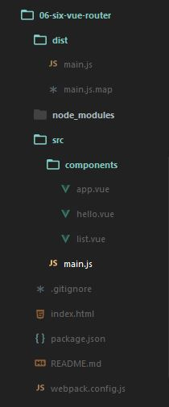

# webpack入坑之旅（六）配合vue-router实现SPA

在上面的练习当中我们已经成功的加载了一个`.vue`格式的单文件组件，并且实现了在使用vue情况下的自动刷新。

但是我们最终的目的还是要实现单页面应用程序，这个时候我们就必不可少的需要使用到路由管理器来进行SPA的开发，vue官方为我们提供了一个官方库[vue-router](https://github.com/vuejs/vue-router)，并且配有对应的[中文文档](http://vuejs.github.io/vue-router/zh-cn/index.html)。关于里面的内容大家自行前去观看。在这里，只会把我们需要的东西拿出来讲。


[TOC]

## vue组件

> [官网对于组件讲解](http://cn.vuejs.org/guide/components.html)


在`Vue`中定义一个组件非常简单，只需要一对**自定义标签**，在其中填入内容就可以进行我们的组件编写了，然后使用`Vue.component()`去注册我们的组件下面来看一个例子，来直观的看看vue的组件。

### 组件入门

```html
    <script src="js/vue.js"></script>
<body>
    <div id="app">
        <my-component></my-component>
        <!-- 自定义标签作为组件名称 -->
        <my-component></my-component>
        <!-- 复用 -->
    </div>
    <script>
        // 定义并且注册组件
        // 在官方的示例中使用 Vue.extend({})先注册了一个定义模板，再引用，看个人喜好吧
        Vue.component("my-component", {
            template:"<h2>hello Vue component</h2>"
        })
        // 创建根实例
        // 在这里 定义并且注册组件 必须创建根实例前，不然会报错，因为解析顺序的问题？
        new Vue({
            el:"#app"
        });
    </script>
</body>
```
上面就是最简单的定义组件的方式，**`template`属性中写的东西**:就是`<my-component>`这个自定义标签渲染后展现出来的样式，这里渲染为：

```html
<div id="app">
    <h2>hello Vue component</h2>
    <h2>hello Vue component</h2>
</div>
```

### 使用template标签

在上面这段代码中组件内的内容都被写在`template`属性中，如果组件中的内容继续增加，一堆的引号和加号来拼接这些字符串简直就是噩梦。所以Vue 引入了`template`标签（html5定义的，浏览器默认不去解析里面的内容）。**`<template> 不能用在 <table> 内`**下面来看看它的使用方法：

```html
    <script src="js/vue.js"></script>
<body>
<!-- 使用 template 并且添加选择器(只能使用id)-->
    <template id="myTemp">
        <h2>This is Template </h2>
        <p>add ...</p>
    </template>
    <div id="app">
        <my-component></my-component>
        <my-component></my-component>
    </div>

    <script>
        Vue.component("my-component", {
            template:"#myTemp"//对应上面定义的template标签中的选择器
        })
        new Vue({
            el:"#app"
        });
    </script>
</body>
```

可以看到在注册组件中，可以`template`可以使用选择器来获取到上面我们`<template>`标签中的内容。所以这里应该会被渲染为：

```html
<div id="app">
    <h2>This is Template </h2>
    <p>add ...</p>
    <h2>This is Template </h2>
    <p>add ...</p>
</div>
```


组件的基础介绍就到这，更多详细内容请移步[官网](http://cn.vuejs.org/guide/) 

## vue-router

刚刚已经对于vue的组件有了一定的了解。现在来结合vue-router，来进行一下动态的切换。

首先是安装，如果使用npm的形式的话，直接运行`npm install vue-router --save`,就可以看到`vue-router`，已经被添加到了项目依赖中。直接上`ES6`的语法来进行引入

```js
import Vue from "vue";
import VueRouter from "vue-router";
Vue.use(VueRouter);
```

### 起步

其实这一部分`vue-router`的[中文文档](http://vuejs.github.io/vue-router/zh-cn/basic.html)中已经讲的非常详细了。。在这里与它不同的是它用的`CommonJS`的规范来进行模块安装，而我使用ES6的import，有兴趣自己去看- -。其他的内容我就直接扒下来了。

html:

```html
<div id="app">
  <h1>Hello App!</h1>
  <p>
    <!-- 使用指令 v-link 进行导航。 -->
    <a v-link="{ path: '/foo' }">Go to Foo</a>
    <a v-link="{ path: '/bar' }">Go to Bar</a>
  </p>
  <!-- 路由外链 -->
  <router-view></router-view>
</div>
```
javascript:

```javascript
// 定义组件
var Foo = Vue.extend({
    template: '<p>This is foo!</p>'
})
var Bar = Vue.extend({
    template: '<p>This is bar!</p>'
})
// 路由器需要一个根组件。
// 出于演示的目的，这里使用一个空的组件，直接使用 HTML 作为应用的模板
var App = Vue.extend({})
// 创建一个路由器实例
// 创建实例时可以传入配置参数进行定制，为保持简单，这里使用默认配置
var router = new VueRouter()
// 定义路由规则
// 每条路由规则应该映射到一个组件。这里的“组件”可以是一个使用 Vue.extend
// 创建的组件构造函数，也可以是一个组件选项对象。
// 稍后我们会讲解嵌套路由
router.map({
    '/foo': {
        component: Foo
    },
    '/bar': {
        component: Bar
    }
})
// 现在我们可以启动应用了！
// 路由器会创建一个 App 实例，并且挂载到选择符 #app 匹配的元素上。
router.start(App, '#app')
```
 
我个人感觉这部分还是很好理解的，官方也给了一个[在线示例应用](http://jsfiddle.net/yyx990803/xyu276sa/)。很好的展现了它的路由切换。

简单的介绍到这，下面最重要的部分到了，看看如何结合我们定义的`.vue`单文件组件。

首先来看我们的文件目录结构：



### 定义路由规则

**最主要是`main.js`**的变化，直接在文件中讲解了：

```js
// 引入vue以及vue-router
import Vue from "vue";
import VueRouter from "vue-router";
Vue.use(VueRouter);
// 引入组件！直接使用es6的语法
import index from './components/app.vue';
import list from './components/list.vue';
import hello from './components/hello.vue';
//开启debug模式
Vue.config.debug = true;
// new Vue(app);//这是上一篇用到的，新建一个vue实例，现在使用vue-router就不需要了。
// 路由器需要一个根组件。
var App = Vue.extend({});
// 创建一个路由器实例
var router = new VueRouter();
// 每条路由规则应该映射到一个组件。这里的“组件”可以是一个使用 Vue.extend创建的组件构造函数，也可以是一个组件选项对象。
// 稍后我们会讲解嵌套路由
router.map({//定义路由映射
    '/index':{//访问地址
        name:'index',//定义路由的名字。方便使用。
        component:index,//引用的组件名称，对应上面使用`import`导入的组件
        //component:require("components/app.vue")//还可以直接使用这样的方式也是没问题的。不过会没有import集中引入那么直观
    },
    '/list': {
        name:'list',
        component: list
    },
});
router.redirect({//定义全局的重定向规则。全局的重定向会在匹配当前路径之前执行。
    '*':"/index"//重定向任意未匹配路径到/index
});
// 现在我们可以启动应用了！
// 路由器会创建一个 App 实例，并且挂载到选择符 #app 匹配的元素上。
router.start(App, '#app');

```
在index.html需要有用于渲染匹配的组件，如下
```html
    <div id="app">
        <router-view></router-view>
    </div>
```

现在当我们运行 `npm start` 进入`http://localhost:8080/`就会自动跳转到`http://localhost:8080/#!/index`，并且读取里面的内容。


### 实现路由跳转

主要抽出`app.vue`中的内容来讲解，的内容是：(`list.vue`里面的内容自行设置查看吧)
```html
<template>
<div>
    <h1>姓名：{{name}}</h1>
    <h2>{{age}}</h2>
    <button @click="golist">$route.router.go查看</button>
    <a v-link="{ name: 'list' }">v-link查看列表</a>
    <a v-link="{ name: 'index' }">回去主页</a>
</div>
</template>
<script>
    export default {//这里是官方的写法，默认导出，ES6
        data () { //ES6，等同于data:function(){}
            return {    //必须使用这样的形式，才能创建出单一的作用域
                name:"guowenfh",
                age:"21"
            }
        },
        methods :{
            golist () {//方法，定义路由跳转，注意这里必须使用this，不然报错
                this.$route.router.go({name:"list"});
            }
        }
    }
</script>
<style></style>
<!-- 样式自行设置，或者直接看源码就好 -->
```

因为自刷新的缘故，直接切换到浏览器。

点击上面使用的`v-link`，与`router.go`的方式都可以跳转到`list`定义的路由。（**观察浏览器地址栏的变化**）在这里我们使用的`{name:"list"}`，使用`{ path: '/list' }`会有同样的效果。

## Vue组件的嵌套

在第一小点里面我们看到了在页面内的组件的使用方法，第二小点中学习到了`vue-router`的制定路由规则。

看过这两个地方之后，我们把思维发散开来，应该就能触类旁通的想到如何在页面中嵌套加载别的组件了。
我们创建一个`hello.vue` ，里面内容随意。现在我们如果要在`app.vue`中加载它，那么只需要在`app.vue`中使用`import hello from "./hello.vue"`（其实这个达到了使用require两步的效果。引入赋值）。

引入之后，只需要如下注册：

```js
export default {
    //其它的就
    components:{
        hello//若还有更多的组件，只需要在import的情况下，以逗号分割，继续注册就好
    }
}
```
最后在`app.vue`中添加`<hello></hello>`这一对自定义标签，就可以实现加载`hello.vue`中的内容。

组件的嵌套也就是这样，很简单的描述完了，但是怎么样去抽离组件，在工作中积累可以复用的组件才是我们真正需要去思考的。

那么先到这，关于组件之间通信的问题，留到以后慢慢了解。

## 路由嵌套

还是刚刚的代码与目录结构，我们已经实现了组件之间的嵌套，但是有时并不希望组件直接就加载进来，而是在用户点击后才展现在页面中，这是就需要使用到路由嵌套。

为了偷懒，这里就直接使用`hello.vue`。实现嵌套路由主要有以下几步：


第一步：制定嵌套路由规则：

看`main.js`下面这部分的代码：

```js
router.map({
    '/index':{
        name:'index',
        component:index,
        // 在/index下设置一个子路由
        subRoutes:{ 
            // 当匹配到/index/hello时，会在index的<router-view>内渲染
            '/hello':{
                name:'hello',//可有可无，主要是为了方便使用
                // 一个hello组件
                component:hello
            }
        }
    },
});
```

第二步：在组件中添加`<router-view>`

> 来自官网的解释：`<router-view>` 用于渲染匹配的组件，它基于Vue的动态组件系统，所以它继承了一个正常动态组件的很多特性。

将`<router-view>`写在`app.vue`的`<template></template>`标签中。

第三步：写入跳转路径

还是在`app.vue`中：
```html
<a v-link="{ name: 'index' }">回去主页</a>
<!-- 点击这两个标签就会实现页面内的切换效果 -->
<a v-link="{ name: 'hello' }">嵌套的路由</a>
```
，切换到浏览器，点击该`嵌套的路由`即可让`hello.vue`中的展现出来，在这里直接使用了`v-link`来实现跳转（知道为什么要写name了吧。。如果使用path会是这样的`{ path: '/index/hello' }`- -。 ） ，当然`router.go`同理。（注意在点击两个不同的文字时，地址栏的变化，以及展现内容的切换）


**注意：**

在我的源码中是在`<style scoped></style>`标签中定义样式的，请注意`scoped`的使用，它表示在该`style`中定义的样式只会在当前的组件中起到效果，而不会去影响全局的css样式。

最简单的理解应该就是：

未写该`scoped`属性的所有组件中的样式，在经过`vue-loader`编译之后拥有全局作用域。相当于共用一份`css`样式表。

而写了该属性的的组件中定义的样式，拥有独立作用域。相当于除去引入了公用的一份`css`样式表外，但单独拥有一份`css`的样式表。


